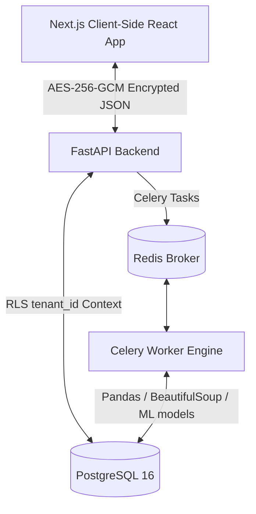

# Architectural Design - ReadyNest Analytics Engine

## Overview

## Security Layout
1. **Network Encryption (AES-256-GCM)**: All responses from FastAPI are intercepted by custom middleware. The payload is encrypted before transmission. The client uses an in-memory key context to decrypt data structure streams.
2. **Database Isolation (RLS)**:
   - Queries set `SET LOCAL app.current_tenant_id = 'tenant-uuid'` in transactions.
   - Policies ensure that only rows matching this tenant ID are select/insert/update/deletable.
3. **UI Source Shielding**:
   - Right-click, F12, and inspector key shortcuts are suppressed.
