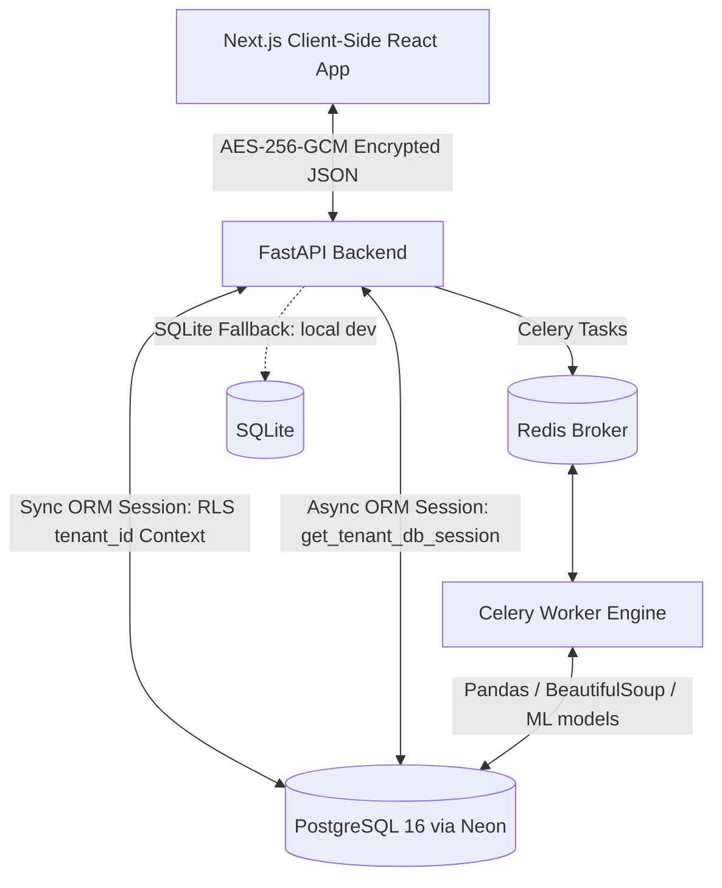

# Architectural Design - ReadyNest Analytics Engine

## Overview

## Layer Breakdown

| Layer | Technology | Location |
|---|---|---|
| API Routing | FastAPI async routes | `/app/api/` |
| Config & Secrets | pydantic-settings | `/app/core/config.py` |
| Crypto Middleware | AES-256-GCM + JWT | `/app/core/security.py` |
| DB Session Management | SQLAlchemy 2.0 sync + async | `/app/core/db.py` |
| ORM Models | SQLAlchemy 2.0 `Mapped` / `mapped_column` | `/app/models/schemas.py` |
| Background Workers | Celery + Redis | `/app/services/worker.py` |
| UI Shell | Next.js 14 App Router (TypeScript) | `/frontend/src/` |
| Client Decryption | Web Crypto API in SecureDataContext | `/frontend/src/context/` |

## Database Schema (Phase 2 — Complete ✅)

| Table | Primary Key | RLS Enabled | FORCE RLS |
|---|---|---|---|
| `tenants` | UUID | ❌ | ❌ |
| `users` | UUID | ✅ | ✅ |
| `pipeline_runs` | UUID | ✅ | ✅ |
| `system_audit_logs` | BIGSERIAL | ✅ | ✅ |

**Performance Indexes:**
- `idx_tenants_company_name` — B-Tree Unique on `tenants(company_name)`
- `idx_users_tenant_username` — B-Tree Compound Unique on `users(tenant_id, username)`
- `idx_pipeline_tenant_status` — Partial B-Tree on `pipeline_runs(tenant_id) WHERE status != 'completed'`

## Security Layout
1. **Network Encryption (AES-256-GCM)**: All responses from FastAPI are intercepted by custom `SecureNetworkShieldMiddleware`. The payload is encrypted before transmission. The client uses an in-memory key context to decrypt data structure streams.
2. **Database Isolation (RLS)**:
   - Sync sessions call `SET LOCAL app.current_tenant_id` via `set_tenant_context()`.
   - Async sessions call `SET LOCAL app.current_tenant_id` inside `get_tenant_db_session()` transaction block.
   - Policies ensure that only rows matching this tenant ID are selectable/insertable/updatable/deletable.
   - `FORCE ROW LEVEL SECURITY` closes the owner-bypass loophole even for the `postgres` superuser.
3. **UI Source Shielding**:
   - Right-click, F12, and inspector key shortcuts are suppressed via root layout event listeners.
4. **SQLite Dev Fallback**:
   - `db.py` auto-detects missing PostgreSQL connectivity and switches to a local SQLite file.
   - A custom ORM event emulator enforces RLS-equivalent filtering for local testing without a running Postgres instance.
