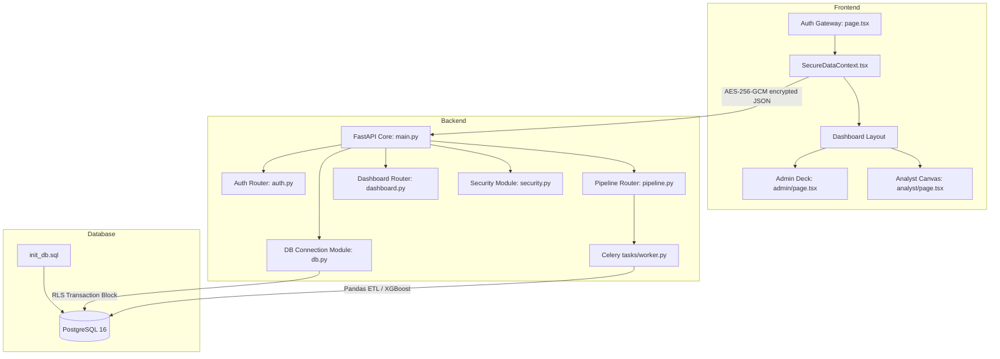

# Dependency Graph - ReadyNest Analytics Engine

```mermaid
graph TD
    subgraph Frontend
        page[Auth Gateway: page.tsx] --> context[SecureDataContext.tsx]
        context --> dashboard[Dashboard Layout]
        dashboard --> admin[Admin Deck: admin/page.tsx]
        dashboard --> analyst[Analyst Canvas: analyst/page.tsx]
    end
    
    subgraph Backend
        main[FastAPI Core: main.py] --> r_auth[Auth Router: auth.py]
        main --> r_pipe[Pipeline Router: pipeline.py]
        main --> r_dash[Dashboard Router: dashboard.py]
        main --> sec[Security Module: security.py]
        main --> db[DB Connection Module: db.py]
        r_pipe --> cel[Celery tasks/worker.py]
    end

    subgraph Database
        db_sql[init_db.sql] --> db_pg[(PostgreSQL 16)]
    end

    context -->|AES-256-GCM encrypted JSON| main
    db -->|RLS Transaction Block| db_pg
    cel -->|Pandas ETL / XGBoost| db_pg
```
